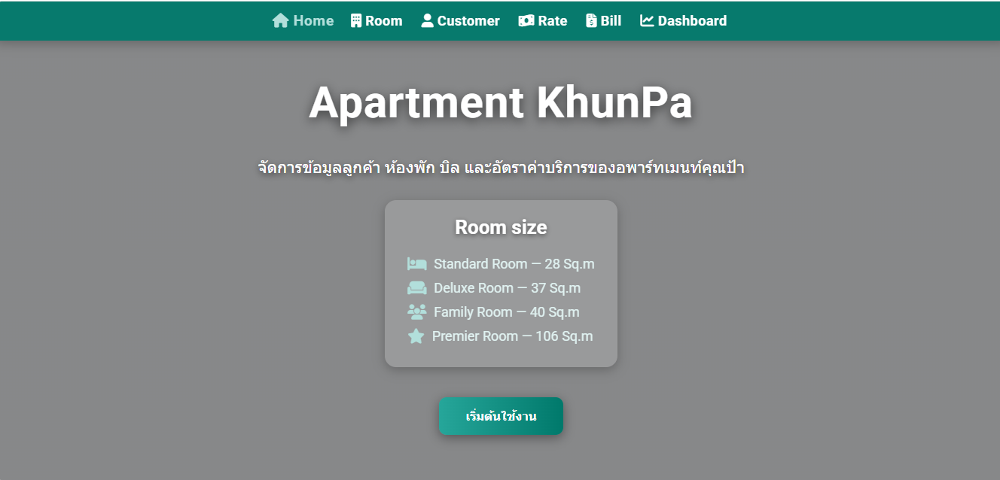
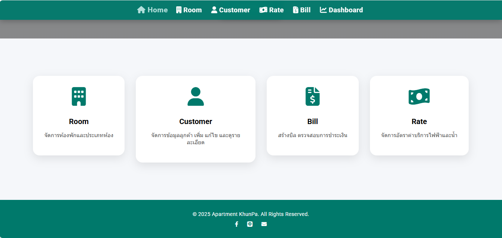
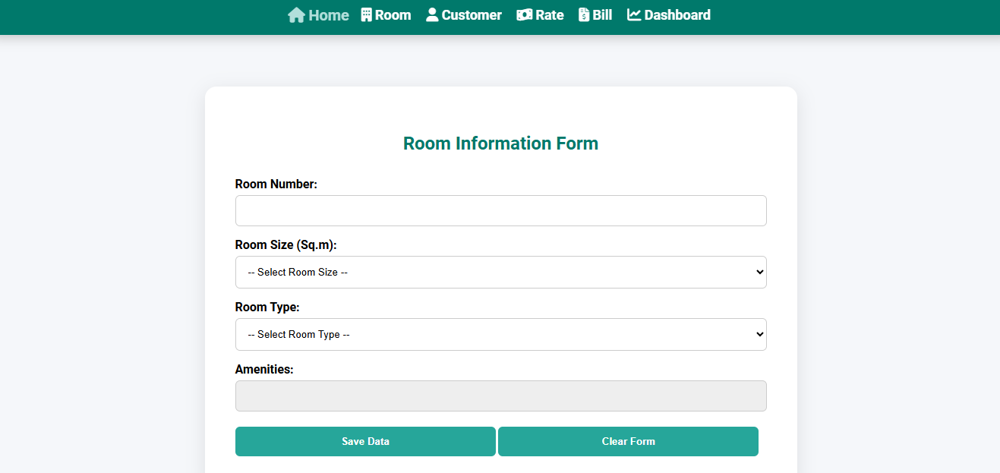
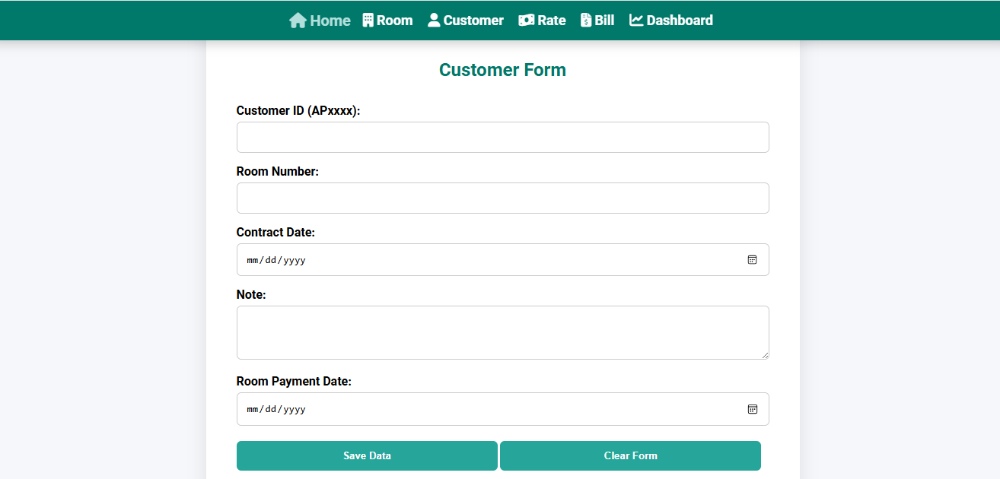
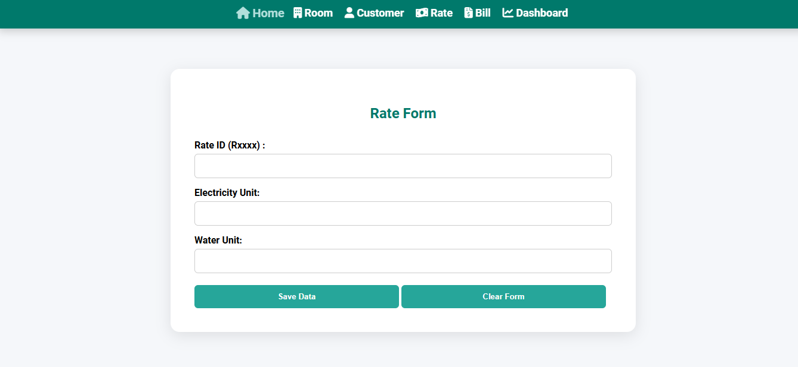
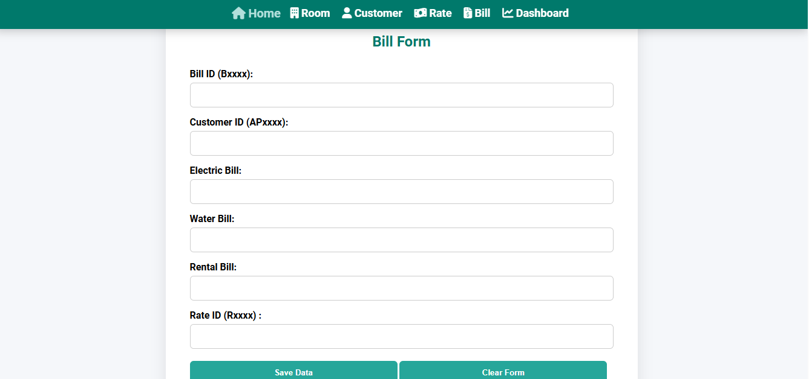
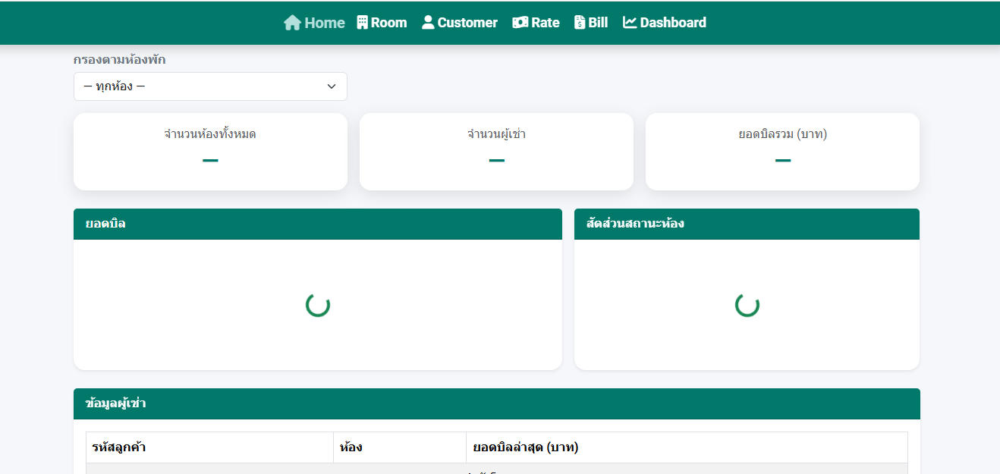

# Apartment Management & Dashboard System

**Web Application & Database Development | PHP · MySQL · SQL · JavaScript · Chart.js**

โปรเจกต์พัฒนาเว็บแอปพลิเคชันสำหรับจัดเก็บและจัดการข้อมูลอพาร์ตเมนต์ โดยเชื่อมต่อหน้าเว็บกับฐานข้อมูล MySQL ผ่าน PHP และนำข้อมูลจากระบบมาแสดงผลผ่าน Dashboard

## Project Overview

ระบบนี้พัฒนาขึ้นสำหรับจัดเก็บข้อมูลที่เกี่ยวข้องกับการบริหารอพาร์ตเมนต์ ได้แก่ ข้อมูลห้องพัก ผู้เช่า อัตราค่าน้ำค่าไฟ และบิล

ผู้ใช้งานสามารถกรอกข้อมูลผ่านแบบฟอร์มบนเว็บไซต์ จากนั้น PHP จะรับข้อมูลและบันทึกลงฐานข้อมูล MySQL

นอกจากนี้ยังมี Dashboard สำหรับดึงข้อมูลจากฐานข้อมูลมาสรุปเป็น KPI กราฟ และตาราง เพื่อดูภาพรวมของข้อมูลภายในระบบ

## Main Features

- บันทึกข้อมูลห้องพัก
- บันทึกข้อมูลผู้เช่าและเชื่อมโยงกับหมายเลขห้อง
- กำหนดอัตราค่าน้ำและค่าไฟ
- บันทึกข้อมูลบิลค่าไฟ ค่าน้ำ และค่าเช่า
- เชื่อมต่อ Web Form กับ PHP และ MySQL
- แสดงจำนวนห้องและจำนวนผู้เช่าบน Dashboard
- คำนวณและแสดงยอดบิลรวม
- แสดงสถานะห้องพัก Occupied และ Vacant
- แสดงข้อมูลผู้เช่าและยอดบิลในรูปแบบตาราง
- กรองข้อมูล Dashboard ตามหมายเลขห้อง

## Technologies Used

- PHP
- MySQL
- SQL
- HTML
- CSS
- JavaScript
- Bootstrap
- Chart.js
- DataTables
- phpMyAdmin
- XAMPP

## Database Design

ระบบใช้ฐานข้อมูล MySQL ชื่อ `apartment` และแบ่งข้อมูลออกเป็น 4 ตารางหลัก ได้แก่

| Table | Description |
|---|---|
| `room` | จัดเก็บข้อมูลห้องพัก |
| `customer` | จัดเก็บข้อมูลผู้เช่าและหมายเลขห้อง |
| `rate` | จัดเก็บอัตราค่าน้ำและค่าไฟ |
| `bill` | จัดเก็บข้อมูลค่าไฟ ค่าน้ำ ค่าเช่า และข้อมูลที่เกี่ยวข้องกับบิล |

ข้อมูลในแต่ละตารางถูกนำมาเชื่อมโยงกันเพื่อใช้ทั้งในส่วนการบันทึกข้อมูลและการแสดงผลบน Dashboard

ตัวอย่างเช่น ก่อนบันทึกข้อมูลผู้เช่า ระบบจะตรวจสอบก่อนว่าหมายเลขห้องที่ระบุมีอยู่ในตาราง `room` หรือไม่

## Data Entry Forms

ระบบมีแบบฟอร์มสำหรับบันทึกข้อมูลหลัก 4 ส่วน

### 1. Room

ใช้สำหรับบันทึกข้อมูลห้องพัก เช่น

- Room Number
- Room Size
- Room Type
- Amenities

ระบบมีประเภทห้องหลายแบบ เช่น Standard Room, Deluxe Room, Family Room และ Premier Room

### 2. Customer

ใช้สำหรับบันทึกข้อมูลผู้เช่า เช่น

- Customer ID
- Room Number
- Contract Date
- Note
- Room Payment Date

ข้อมูลผู้เช่าจะเชื่อมโยงกับหมายเลขห้องที่มีอยู่ในระบบ

### 3. Rate

ใช้สำหรับบันทึกอัตราค่าสาธารณูปโภค ได้แก่

- Rate ID
- Electricity Unit
- Water Unit

### 4. Bill

ใช้สำหรับบันทึกข้อมูลบิล ได้แก่

- Bill ID
- Customer ID
- Electric Bill
- Water Bill
- Rental Bill
- Rate ID

ข้อมูลจากแบบฟอร์มถูกส่งไปยัง PHP Back-end และบันทึกลง MySQL

## System Workflow

การทำงานหลักของระบบเป็นดังนี้

1. บันทึกข้อมูลห้องพัก
2. บันทึกข้อมูลผู้เช่าและระบุห้องพัก
3. กำหนดอัตราค่าน้ำและค่าไฟ
4. บันทึกข้อมูลบิลของผู้เช่า
5. PHP รับข้อมูลจาก Web Form
6. บันทึกข้อมูลลงฐานข้อมูล MySQL
7. ใช้ SQL Query ดึงและรวมข้อมูลจากฐานข้อมูล
8. ส่งข้อมูลให้ Dashboard ในรูปแบบ JSON
9. แสดงผลผ่าน KPI, Chart และ Data Table

## Dashboard

Dashboard ใช้ข้อมูลจากฐานข้อมูล MySQL เพื่อสรุปข้อมูลภายในระบบ

### KPI

แสดงตัวชี้วัดหลัก ได้แก่

- **จำนวนห้องทั้งหมด**
- **จำนวนผู้เช่า**
- **ยอดบิลรวม**

ยอดบิลรวมคำนวณจาก

```text
Electric Bill + Water Bill + Rental Bill
```

### Room Filter

ผู้ใช้งานสามารถเลือกหมายเลขห้องจาก Dropdown เพื่อดูข้อมูลเฉพาะห้องที่ต้องการ

เมื่อเลือกห้อง ระบบจะดึงข้อมูลใหม่จาก PHP Back-end และอัปเดตข้อมูลบน Dashboard

### Bill Chart

ใช้ Chart.js สร้าง Line Chart สำหรับแสดงยอดบิลของแต่ละห้อง

กราฟช่วยให้สามารถเปรียบเทียบยอดบิลระหว่างห้องพักได้จากข้อมูลที่บันทึกอยู่ในฐานข้อมูล

### Room Status

สถานะห้องถูกกำหนดจากข้อมูลผู้เช่า

- **OCCUPIED** — มีข้อมูลผู้เช่าเชื่อมโยงกับห้อง
- **VACANT** — ไม่มีข้อมูลผู้เช่าเชื่อมโยงกับห้อง

จากนั้นนำจำนวนห้องแต่ละสถานะมาแสดงด้วย Doughnut Chart

### Customer Table

Dashboard มีตารางสำหรับแสดงข้อมูล ได้แก่

- Customer ID
- Room Number
- Total Bill

ตารางพัฒนาด้วย DataTables เพื่อช่วยจัดรูปแบบและแสดงข้อมูลผู้เช่าจากฐานข้อมูล

## Front-end & Back-end Connection

หน้าเว็บใช้ JavaScript `fetch()` ส่งข้อมูลจาก Form ไปยัง PHP และใช้ PHP เชื่อมต่อกับ MySQL

ตัวอย่างการทำงาน

```text
HTML Form
   ↓
JavaScript / Fetch
   ↓
PHP
   ↓
MySQL
   ↓
SQL Query
   ↓
JSON
   ↓
Dashboard
```

ส่วนการบันทึกข้อมูลใน PHP ใช้ Prepared Statements และ Transaction สำหรับส่งข้อมูลเข้าแต่ละตาราง

## Skills Demonstrated

- Web Application Development
- Relational Database
- MySQL
- SQL Queries
- PHP Back-end
- HTML & CSS
- JavaScript
- Front-end / Back-end Integration
- Form Handling
- Prepared Statements
- Database Transactions
- Data Visualization
- Dashboard Development
- Chart.js
- DataTables

## Project Activities

โปรเจกต์นี้ครอบคลุมตั้งแต่การออกแบบโครงสร้างข้อมูล การสร้างหน้าเว็บสำหรับกรอกข้อมูล การเชื่อมต่อ PHP กับ MySQL การเขียน SQL สำหรับบันทึกและดึงข้อมูล ไปจนถึงการนำข้อมูลจากฐานข้อมูลมาแสดงเป็น Dashboard

## Project Structure

```text
web-data-management-dashboard/
│
├── README.md
│
├── database/
│   ├── schema.sql
│   └── ERD.png
│
├── src/
│   ├── index.html
│   ├── room.html
│   ├── customer.html
│   ├── rate.html
│   ├── bill.html
│   ├── dashboard.html
│   │
│   └── php_file/
│       ├── db.php
│       ├── dashboard.php
│       ├── get_bills_table.php
│       ├── get_customers_table.php
│       ├── get_metrics.php
│       ├── get_room_status_dist.php
│       ├── get_rooms.php
│       ├── insert_bill.php
│       ├── insert_customer.php
│       ├── insert_rate.php
│       └── insert_room.php
│
└── screenshots/
```

## ERD

โครงสร้างฐานข้อมูลและความสัมพันธ์ระหว่างข้อมูล Room, Customer, Bill และ Rate

<p align="center">
  
</p>

## Application Screenshots

### 1. Home Page

หน้าหลักของระบบสำหรับเข้าสู่ส่วนจัดการ Room, Customer, Bill และ Rate

<p align="center">
  
</p>

### 2. Main Menu

เมนูสำหรับเลือกส่วนที่ต้องการใช้งานภายในระบบ

<p align="center">
  
</p>

### 3. Room Management

แบบฟอร์มสำหรับบันทึกข้อมูลห้องพัก

<p align="center">
  
</p>

### 4. Customer Management

แบบฟอร์มสำหรับบันทึกข้อมูลผู้เช่าและหมายเลขห้อง

<p align="center">
  
</p>

### 5. Utility Rate Management

แบบฟอร์มสำหรับบันทึกอัตราค่าน้ำและค่าไฟ

<p align="center">
  
</p>

### 6. Bill Management

แบบฟอร์มสำหรับบันทึกค่าไฟ ค่าน้ำ และค่าเช่าของผู้เช่า

<p align="center">
  
</p>

### 7. Dashboard

Dashboard สำหรับดูจำนวนห้อง จำนวนผู้เช่า ยอดบิลรวม กราฟยอดบิล สถานะห้อง และข้อมูลผู้เช่า

<p align="center">
  
</p>

> **หมายเหตุ:** Dashboard ดึงข้อมูลผ่าน PHP Back-end จากฐานข้อมูล MySQL ดังนั้นเมื่อเปิดเฉพาะไฟล์ Front-end โดยไม่ได้เชื่อมต่อฐานข้อมูล ค่า KPI กราฟ และตารางอาจไม่แสดงข้อมูล

## Project Type

**Academic Project — Web Application & Relational Database Development**

โปรเจกต์นี้จัดทำขึ้นเพื่อฝึกการพัฒนา Web Application ที่เชื่อมต่อกับฐานข้อมูล ตั้งแต่การรับข้อมูลผ่าน Form การจัดเก็บข้อมูลด้วย MySQL การใช้ PHP และ SQL ใน Back-end ไปจนถึงการนำข้อมูลมาแสดงผลผ่าน Dashboard

> **Note:** ข้อมูลและระบบที่แสดงใน Repository นี้จัดทำขึ้นเพื่อการศึกษาและการนำเสนอผลงานใน Portfolio
