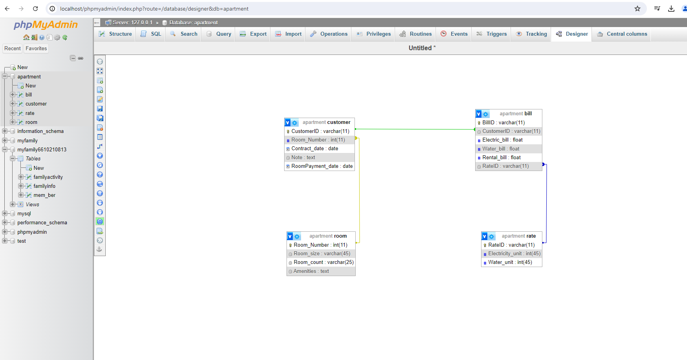

# Apartment Management & Dashboard System

**Web Application & Database Project | PHP · MySQL · SQL · HTML · CSS · JavaScript · phpMyAdmin**

## Project Overview

โครงงานนี้เป็นการพัฒนาระบบบริหารจัดการข้อมูลอพาร์ตเมนต์ผ่านเว็บแอปพลิเคชัน
สำหรับจัดเก็บและจัดการข้อมูลห้องพัก ผู้เช่า บิล และอัตราค่าน้ำค่าไฟ
โดยใช้ MySQL ในการจัดเก็บข้อมูลและออกแบบฐานข้อมูลแบบ Relational Database

ระบบสามารถเพิ่มและจัดการข้อมูลผ่านแบบฟอร์มบนเว็บไซต์
พร้อม Dashboard สำหรับสรุปและแสดงผลข้อมูล เพื่อช่วยให้สามารถตรวจสอบ
ค้นหา และติดตามข้อมูลที่เกี่ยวข้องกับการบริหารจัดการอพาร์ตเมนต์ได้สะดวกมากขึ้น

## Key Features

- จัดการข้อมูลห้องพัก (Room Management)
- จัดการข้อมูลผู้เช่า (Customer Management)
- บันทึกและจัดการข้อมูลบิลค่าเช่า ค่าน้ำ และค่าไฟ
- จัดการอัตราค่าน้ำและค่าไฟ
- เชื่อมโยงข้อมูลระหว่างตารางด้วย Relational Database
- กรองและค้นหาข้อมูลตามห้องพัก
- แสดง KPI เช่น จำนวนห้อง จำนวนผู้เช่า และยอดบิลรวม
- แสดงข้อมูลผ่านกราฟและตารางบน Dashboard

## Technologies Used

- PHP
- MySQL / SQL
- HTML
- CSS
- JavaScript
- Bootstrap
- Chart.js
- DataTables
- phpMyAdmin
- XAMPP

## Database Design

ฐานข้อมูลประกอบด้วย 4 ตารางหลัก ได้แก่

- `room` — จัดเก็บข้อมูลห้องพัก
- `customer` — จัดเก็บข้อมูลผู้เช่า
- `bill` — จัดเก็บข้อมูลบิล
- `rate` — จัดเก็บข้อมูลอัตราค่าน้ำและค่าไฟ

ตารางต่าง ๆ เชื่อมโยงกันด้วย Primary Key และ Foreign Key
เพื่อจัดโครงสร้างข้อมูลให้เป็นระบบและรองรับการเรียกใช้ข้อมูลที่สัมพันธ์กัน

## Dashboard

Dashboard ใช้สำหรับสรุปและแสดงผลข้อมูลสำคัญของระบบ เช่น

- จำนวนห้องทั้งหมด
- จำนวนผู้เช่า
- ยอดบิลรวม
- กราฟแสดงข้อมูลบิล
- สัดส่วนสถานะห้องพัก
- ตารางข้อมูลผู้เช่า
- การกรองข้อมูลตามห้องพัก

## System Workflow

1. เพิ่มและจัดการข้อมูลห้องพัก
2. บันทึกข้อมูลผู้เช่าและเชื่อมโยงกับห้องพัก
3. กำหนดอัตราค่าน้ำและค่าไฟ
4. บันทึกข้อมูลบิลของผู้เช่า
5. จัดเก็บข้อมูลลงฐานข้อมูล MySQL
6. ดึงข้อมูลจากฐานข้อมูลผ่าน PHP
7. สรุปและแสดงผลข้อมูลผ่าน Dashboard

## My Responsibilities

- ออกแบบและพัฒนา Web Application สำหรับจัดการข้อมูลอพาร์ตเมนต์
- ออกแบบโครงสร้าง Relational Database และความสัมพันธ์ระหว่างตาราง
- พัฒนาแบบฟอร์มสำหรับจัดการข้อมูล Room, Customer, Rate และ Bill
- พัฒนา PHP Back-end สำหรับเชื่อมต่อและจัดการข้อมูลใน MySQL
- เขียน SQL Queries สำหรับเพิ่มและเรียกใช้ข้อมูล
- เชื่อมต่อ Front-end กับ PHP และ MySQL
- พัฒนา Dashboard สำหรับแสดง KPI กราฟ และตารางข้อมูล

## Project Structure

```text
web-data-management-dashboard/
│
├── README.md
│
├── database/
│   ├── schema.sql
│   └── ERD.png
│
├── src/
│   ├── index.html
│   ├── room.html
│   ├── customer.html
│   ├── rate.html
│   ├── bill.html
│   ├── dashboard.html
│   │
│   └── php_file/
│       ├── db.php
│       ├── dashboard.php
│       ├── get_bills_table.php
│       ├── get_customers_table.php
│       ├── get_metrics.php
│       ├── get_room_status_dist.php
│       ├── get_rooms.php
│       ├── insert_bill.php
│       ├── insert_customer.php
│       ├── insert_rate.php
│       └── insert_room.php
│
└── screenshots/
```

## ERD
โครงสร้างฐานข้อมูลและความสัมพันธ์ระหว่าง Room, Customer, Bill และ Rate
<p align="center">
  
</p>


## Application Screenshots

ตัวอย่างหน้าจอการทำงานของระบบ ตั้งแต่หน้าหลัก การจัดการข้อมูลห้องพัก
ข้อมูลลูกค้า อัตราค่าสาธารณูปโภค การออกบิล และ Dashboard สำหรับสรุปข้อมูล

### 1. Home Page

<p align="center">
  
</p>

### 2. Main Menu

<p align="center">
  
</p>

### 3. Room Management

<p align="center">
  
</p>

### 4. Customer Management

<p align="center">
  
</p>

### 5. Utility Rate Management

<p align="center">
  
</p>

### 6. Bill Management

<p align="center">
  
</p>

### 7. Dashboard

<p align="center">
  
</p>

> **หมายเหตุเกี่ยวกับ Dashboard:** ภาพตัวอย่างแสดงส่วนติดต่อผู้ใช้ของ Dashboard สำหรับ Portfolio โดยข้อมูลบน Dashboard จะถูกดึงจากฐานข้อมูล MySQL ผ่าน PHP Back-end เมื่อระบบทำงานในสภาพแวดล้อมที่เชื่อมต่อฐานข้อมูล

## Project Type

**Academic Project — Web Application & Relational Database Development**

โปรเจกต์นี้พัฒนาขึ้นเพื่อประยุกต์ใช้การออกแบบฐานข้อมูลเชิงสัมพันธ์
การพัฒนา Web Application การเชื่อมต่อ Front-end กับ PHP/MySQL
การจัดการข้อมูลด้วย SQL และการนำข้อมูลมาแสดงผลผ่าน Dashboard

> **Note:** ข้อมูลที่แสดงใน Repository นี้ใช้เพื่อการศึกษาและการนำเสนอผลงานใน Portfolio
